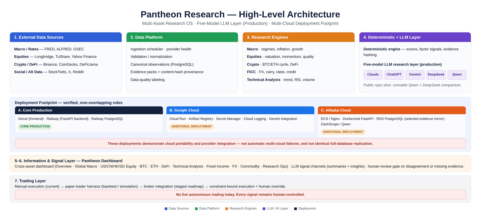
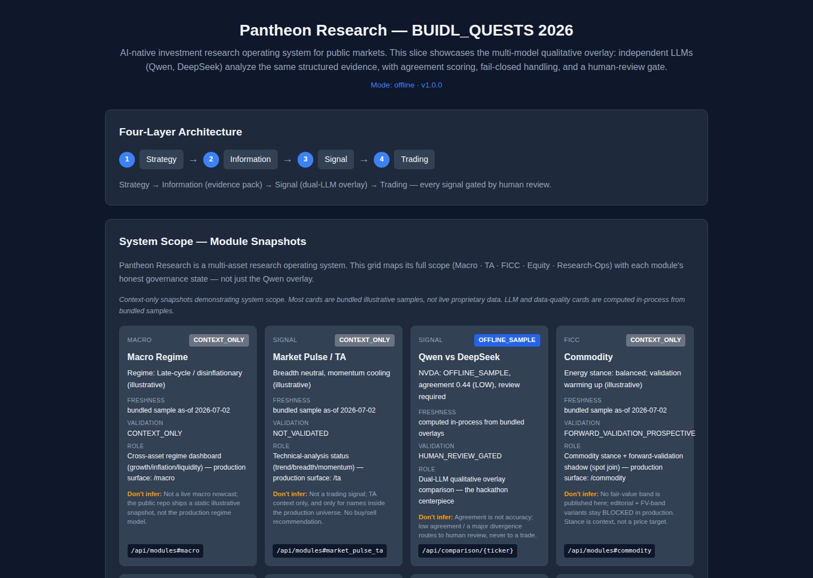
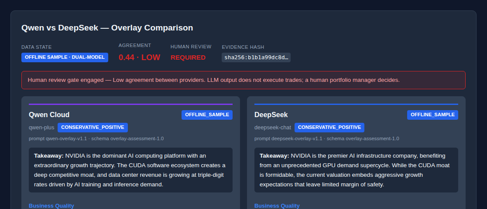
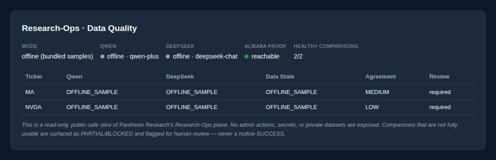

# Pantheon Research — BUIDL_QUESTS 2026

> **AI-native investment research operating system for public markets.**

Pantheon Research unifies structured market data, institutional-style investment
frameworks, deterministic signal engines, backtest analytics, data-quality
operations, and multi-model LLM research overlays across public markets.

> **Core belief:** AI should not replace the investor. AI should compound the
> investor's discipline.

[](https://github.com/0xjacobzhao-byte/pantheon-research-buidl-quests-2026/actions/workflows/ci.yml)
[](LICENSE)
[](backend/requirements.txt)
[](frontend/package.json)
[](docker-compose.yml)
[](https://pantheon-research.com)

---

## Submission Links

| | |
|---|---|
| 🌐 Live Product | https://pantheon-research.com |
| 💻 Public Code (this repo) | https://github.com/0xjacobzhao-byte/pantheon-research-buidl-quests-2026 |
| 📋 Judge Evidence | [`docs/judge_evidence.md`](docs/judge_evidence.md) |
| 🏗️ Architecture | [`docs/architecture.md`](docs/architecture.md) |
| 👤 Founder / X | https://x.com/0xjacobzhao |
| ☁️ Alibaba Cloud Deployment Proof *(supporting evidence)* | http://8.222.191.152/api/proof/alibaba-cloud |

> A demo video and pitch deck can be attached in the OpenArena form once
> recorded for this submission. Prior hackathon media is not reused here unless
> it accurately represents this BUIDL_QUESTS submission.

---

## At a Glance

| Dimension | Current state |
|---|---|
| Product | Live cross-asset investment research platform |
| Research coverage | Macro, US/CN/HK/SG Equities, Bitcoin, Ethereum, DeFi, Technical Analysis, Fixed Income, Currencies, Commodities, Research Ops |
| LLM layer (production) | Claude, ChatGPT, Gemini, DeepSeek, and Qwen |
| Public demo (this repo) | Runnable, evidence-grounded Qwen + DeepSeek comparison |
| Core production deployment | Vercel (frontend) + Railway (backend + PostgreSQL) |
| Additional deployments | Google Cloud (Cloud Run + Gemini) and Alibaba Cloud (ECS + DashScope/Qwen) |
| Governance | Evidence hashing, fail-closed provider states, human-review gate |
| Execution | Human-controlled — no live autonomous trading |

---

## Architecture

<p align="center">
  
</p>

<p align="center"><sub>This diagram represents the full Pantheon Research production architecture. The public repository below is a sanitized, representative slice of it — see <a href="#production-vs-public-repository-slice">Production vs. Public Repository Slice</a>.</sub></p>

---

## What Problem Pantheon Solves

Serious investment research is fragmented across a dozen disconnected tools —
market data, fundamentals, macro context, technical signals, and cross-asset
read-through. The issue is not a lack of information; it's a lack of
**structured decision intelligence**. Pantheon connects deterministic research
frameworks with evidence-grounded LLM interpretation in one platform, so a
single operator can run an institutional-style research process.

---

## Product Coverage

Pantheon Research is a **cross-asset** research operating system covering:

| | | | |
|---|---|---|---|
| Overview | Global Macro | US Equities | China Equities |
| Hong Kong Equities | Singapore Equities | Bitcoin | Ethereum |
| DeFi | Technical Analysis | Fixed Income | Currencies (FX) |
| Commodities | Research Ops | | |

**Production Pantheon Research** covers all domains above with structured
frameworks, data feeds, and dashboards. **This public repository slice** is a
representative, runnable subset — see the [scope table](#production-vs-public-repository-slice)
below.

---

## Four-Layer Architecture

```text
Strategy ──▶ Information ──▶ Signal ──▶ Trading
```

| Layer | Role |
|-------|------|
| **Strategy** | Research frameworks and investment hypotheses; universe selection |
| **Information** | Normalized market data, evidence packs, APIs, and dashboards |
| **Signal** | Deterministic signals **plus** LLM research interpretation of structured evidence |
| **Trading** | Manual execution today; a staged, human-gated roadmap toward constraint-bound execution |

Final investment decisions remain human-controlled. LLM overlay outputs can
trigger a human-review requirement when models disagree or evidence is missing
— they never execute a trade.

---

## AI Innovation

Pantheon separates a **deterministic framework layer** from a **multi-model LLM
research-overlay layer** — the LLM interprets governed evidence, it does not
free-associate from a raw prompt.

**Deterministic framework layer**
* normalized evidence packs;
* versioned scoring and signal logic;
* backtests;
* data-quality states (`data_state` honesty);
* auditability via content hashing.

**Five-model LLM research layer (production)**
* Claude, ChatGPT, Gemini, DeepSeek, and Qwen;
* a consistent research schema across providers;
* evidence-grounded interpretation, not raw-prompt generation;
* side-by-side provider comparison;
* disagreement detection and missing-evidence surfacing;
* a human-review gate.

LLMs interpret evidence; they do not replace deterministic computation.

---

## Production vs. Public Repository Slice

| Capability | Production Pantheon Research | Public BUIDL_QUESTS repository |
|---|---|---|
| Cross-asset dashboards | Full product coverage | Representative context-only mini panels |
| LLM providers | Claude, ChatGPT, Gemini, DeepSeek, Qwen | Runnable Qwen + DeepSeek comparison slice |
| Market coverage | Full supported universes | Sanitized MA / NVDA examples |
| Database | Production PostgreSQL + runtime stores | Bundled offline sample data |
| Cloud deployment | Vercel + Railway (core), Google Cloud, Alibaba Cloud | Docker local demo + public deployment-proof evidence |
| Secrets | Managed privately | None included |
| Trading | Human-controlled / staged roadmap | No execution |

This repository does not claim full parity with production — it is a sanitized,
self-contained, judge-runnable slice.

---

## Why This Is Not Just an LLM Wrapper

Every capability below points to a real file in this repository.

| Capability | Implementation |
|------------|---------------|
| **Evidence packs + content hash** — every pack committed to a `sha256` hash threaded into each comparison | [`evidence_pack.py`](backend/app/evidence_pack.py) |
| **Explicit provider states** — missing key → `BLOCKED_BY_MISSING_CREDENTIAL`, bad JSON → `PARSE_ERROR`, missing sample → `QWEN_NOT_GENERATED` | [`qwen_overlay.py`](backend/app/qwen_overlay.py) · [`models.py`](backend/app/models.py) |
| **Fail-closed handling** — a blocked or malformed provider never silently reports a hollow success | [`qwen_overlay.py`](backend/app/qwen_overlay.py) · [`deepseek_overlay.py`](backend/app/deepseek_overlay.py) |
| **Multi-model agreement & divergence** — per-field divergence, `data_state` (`LIVE_DUAL` / `OFFLINE_SAMPLE` / `MIXED` / `PARTIAL` / `BLOCKED`) | [`comparison.py`](backend/app/comparison.py) |
| **Missing-evidence surfacing** — comparisons enumerate what the models could not evaluate | [`comparison.py`](backend/app/comparison.py) |
| **Human-review gate** — low agreement or major divergence flags `human_review_required` | [`comparison.py`](backend/app/comparison.py) · [`OverlayComparisonPanel.tsx`](frontend/src/components/equity/OverlayComparisonPanel.tsx) |
| **Research-Ops governance** — provider config, coverage, per-ticker state | [`data_quality.py`](backend/app/data_quality.py) · [`DataQualityPanel.tsx`](frontend/src/components/DataQualityPanel.tsx) |
| **Reproducible offline demo** — the full workflow runs with zero secrets | [`sample_loader.py`](backend/app/sample_loader.py) · [`scripts/judge_smoke.sh`](scripts/judge_smoke.sh) |

---

## Multi-Cloud Deployment

Pantheon Research has been **deployed and validated** across three cloud
footprints, each demonstrating a distinct capability:

| Stack | Role | Components |
|---|---|---|
| **Vercel + Railway** | Core production | Vercel frontend, Railway FastAPI backend, Railway PostgreSQL |
| **Google Cloud** | Completed deployment path + Gemini integration | Cloud Run, Artifact Registry, Secret Manager, Cloud Logging |
| **Alibaba Cloud** | Completed deployment path + Qwen integration | ECS/Nginx, Dockerized FastAPI, RDS PostgreSQL (selected evidence mirror), DashScope/Qwen |

**Non-claim:** these deployments demonstrate cloud portability and provider
integration. This repository does **not** claim automatic multi-cloud failover
or identical full-database replication across stacks — see the precise
database-claim breakdown in [`docs/live_proof.md`](docs/live_proof.md) and
[`docs/alibaba_deployment_parity.md`](docs/alibaba_deployment_parity.md).

The secret-free `/api/proof/alibaba-cloud` endpoint reports host/runtime and
credential state as **booleans only**, makes no external calls, and never
claims connectivity it did not verify —
[`alibaba_cloud_proof.py`](backend/app/alibaba_cloud_proof.py).

---

## Why This Fits the OPC Model

Pantheon Research demonstrates the OPC model through **AI-multiplied founder
execution**, not through fully autonomous company control. One founder
coordinates product design, research methodology, engineering, cloud
deployment, data operations, model evaluation, and go-to-market — using
AI-assisted development and a multi-model research layer to reach institutional
breadth solo, while retaining full product judgment and investment
responsibility.

---

## Current Progress

| Item | Status |
|---|---|
| Live web product | **Live** — pantheon-research.com |
| Deterministic frameworks + data platform | **Live** |
| Five-model LLM research layer | **Completed** |
| Research Ops / data-quality tooling | **Live** |
| Vercel + Railway (core production) | **Live** |
| Google Cloud deployment + Gemini integration | **Completed** |
| Alibaba Cloud deployment + Qwen integration | **Completed** |
| PWA / mobile support | **In progress** |
| WeChat Mini Program | **In progress** |
| Telegram distribution | **In progress** |
| Backtest / forward-validation | **Validation-only** — methodology documented, not an alpha claim |
| Commercialization / membership readiness | **In progress** |

---

## Business Model

* subscription plans for individual investors;
* reusable investment "Skills";
* paid research and evaluation APIs;
* B2B / institutional licensing;
* future proprietary-trading upside — **only after validation**, not today.

No revenue, user, or AUM figures are claimed.

---

## 3-Minute Judge Path

1. **Open the live product** — https://pantheon-research.com
2. **Read the architecture** — the [diagram above](#architecture) and [`docs/architecture.md`](docs/architecture.md)
3. **Inspect the evidence-pack + multi-model comparison code** —
   [`backend/app/evidence_pack.py`](backend/app/evidence_pack.py) ·
   [`backend/app/comparison.py`](backend/app/comparison.py)
4. **Run the offline demo**
   ```bash
   docker compose up --build          # frontend :5173 · backend :8000
   ```
5. **Run the smoke test**
   ```bash
   ./scripts/judge_smoke.sh           # offline, no secrets
   ```
6. **Read the full evidence guide** — [`docs/judge_evidence.md`](docs/judge_evidence.md)

---

## Product Evidence

**Cross-asset overview & module scope** — the four-layer architecture and the
system-scope module grid, run locally from this repository:

<p align="center">
  
</p>

**Multi-model qualitative overlay comparison** — Qwen and DeepSeek independently
analyzing the same NVDA evidence pack, with agreement scoring and a human-review
gate:

<p align="center">
  
</p>

**Research-Ops / data-quality governance** — a read-only, public-safe snapshot
of provider configuration and comparison health:

<p align="center">
  
</p>

---

## Quick Start

```bash
git clone https://github.com/0xjacobzhao-byte/pantheon-research-buidl-quests-2026
cd pantheon-research-buidl-quests-2026
docker compose up --build          # frontend :5173 · backend :8000
./scripts/judge_smoke.sh           # end-to-end smoke test (offline, no secrets)
```

<details>
<summary><b>Manual setup (no Docker)</b></summary>

**Backend** (Python 3.11–3.12):
```bash
cd backend && python -m venv .venv && source .venv/bin/activate
pip install -r requirements.txt
uvicorn main:app --reload --port 8000
```

**Frontend** (Node.js 18+):
```bash
cd frontend && npm install && npm run dev
```

| Service | URL |
|---------|-----|
| Frontend | http://localhost:5173 |
| Backend API | http://localhost:8000 |
| API Docs (Swagger) | http://localhost:8000/docs |

</details>

---

## Tests

Verified in this repository:

```bash
cd backend && python -m pytest             # 84 backend tests
cd frontend && npm test -- --run           # 9 frontend tests
cd frontend && npm run build               # production build (tsc + vite)
docker compose config                      # validate compose file
./scripts/judge_smoke.sh                   # end-to-end smoke (18 checks, offline)
```

---

## Safety & Public/Private Boundary

AI **assists** research; LLM outputs are **not investment advice**, and missing
or unusable data **fails closed** rather than fabricating a result. Humans
retain investment judgment at every step, and Pantheon Research does **not**
currently execute autonomous trades. This repository is a sanitized,
self-contained public slice — full details in
[`docs/security_and_sanitization.md`](docs/security_and_sanitization.md). No
API keys, private user data, live trading credentials, production secrets, or
private financial records are included.

---

## Tech Stack

| Layer | Technology |
|-------|-----------|
| Backend | FastAPI · Python 3.11–3.12 |
| Frontend | React 18 · TypeScript · Vite 6 |
| LLM providers (public slice) | Qwen (Alibaba DashScope) · DeepSeek — both OpenAI-compatible |
| LLM providers (production) | Claude, ChatGPT, Gemini, DeepSeek, Qwen |
| Database | PostgreSQL (Railway / Alibaba RDS-compatible) — production only |
| Deploy | Docker Compose · Vercel + Railway (core) · Google Cloud · Alibaba Cloud |
| Tests | pytest (backend) · vitest + Testing Library (frontend) |

---

## Author & License

**Jacob Zhao** — [0xjacobzhao-byte](https://github.com/0xjacobzhao-byte) ·
[x.com/0xjacobzhao](https://x.com/0xjacobzhao)

**License:** Apache-2.0 — see [LICENSE](LICENSE).

No API keys, private user data, live trading credentials, production secrets, or
private financial records are included in this repository.
