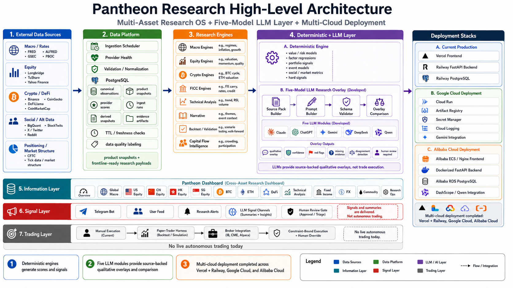

<div align="center">

# Pantheon Research

### Institutional-grade cross-asset research command center

**Transforming complex market noise into structured investment intelligence**

Pantheon Research combines quantitative frameworks, risk-regime models, governed
market data, deterministic signal engines, backtest analytics, narrative
research, and multi-model AI overlays across Global Macro, Equities, Crypto,
DeFi, Technical Analysis, Commodities, Fixed Income, and Currencies.

> **AI should not replace the investor. AI should compound the investor's discipline.**

**BUIDL_QUESTS 2026 · OPC Hackathon Submission**

[](https://github.com/0xjacobzhao-byte/pantheon-research-buidl-quests-2026/actions/workflows/ci.yml)
[](LICENSE)
[](https://pantheon-research.com)

</div>

---

## Essential Links

| Resource | Link |
|---|---|
| Live Product | https://pantheon-research.com |
| Public Review Repository | https://github.com/0xjacobzhao-byte/pantheon-research-buidl-quests-2026 |
| Full Production Repository | https://github.com/0xjacobzhao-byte/Pantheon-Research — **Private · closed-source; temporary read-only access available to judges upon request** |
| Judge Verification Guide | [`docs/judge_evidence.md`](docs/judge_evidence.md) |
| Founder | Jacob Zhao · [x.com/0xjacobzhao](https://x.com/0xjacobzhao) |

---

## Executive Summary

Pantheon Research is an institutional-grade cross-asset research command center.
It is built for sophisticated investors, research analysts, allocators, and
crypto-native market participants who need disciplined, explainable decision
support across the whole opportunity set — macro, equities, digital assets, and
FICC — rather than a dozen disconnected tools stitched together by hand.

The problem is not a lack of financial information. **The problem is the absence
of structured, governed, and explainable decision intelligence.** Markets
produce more data than any individual can process, but raw data is not a view,
and a raw model opinion is not research. Pantheon sits between the two: it turns
governed market evidence and disciplined investment frameworks into research that
can be audited, compared, and acted on with confidence.

Pantheon is deliberately **not** a market-data dashboard, **not** a finance
chatbot, **not** a raw-LLM opinion generator, and **not** an autonomous trading
system. It is a research operating system in which deterministic frameworks
produce reproducible scores and signals, a five-model LLM layer interprets and
stress-tests governed evidence, and a human remains the portfolio manager. AI
compounds the investor's discipline; it does not remove the investor's
accountability.

This public repository is the **open-source, judge-runnable review version** of
that system: a sanitized vertical slice you can clone and run in minutes, with a
live Qwen + DeepSeek research-overlay comparison, evidence-pack provenance,
data-quality governance, and reproducible tests — free of production credentials
and proprietary strategy implementation.

---

## The Pantheon Thesis

1. **Framework First.** Investment discipline precedes AI. Frameworks define what
   matters, what invalidates a view, and when the system must refuse to conclude.
2. **Data Governed.** Every observation carries provenance, freshness, quality,
   and provider state — missing or stale data is labeled, never silently guessed.
3. **Signal Is Not a Trade.** Research output, portfolio judgment, and execution
   are separate architectural layers, by design.
4. **LLM as Analyst, Not Oracle.** Models explain, challenge, compare, detect
   contradictions, and surface missing evidence — they do not generate positions.
5. **Human Remains Portfolio Manager.** AI compounds discipline; it does not
   remove accountability.

> Wrong strategy × AI = faster failure.
> Right strategy × AI = compounded discipline.

---

## Architecture

<!-- ARCHITECTURE IMAGE: place the approved diagram at the exact path below before
     merging this branch. The  below then renders automatically with no edits. -->
<p align="center">
  
</p>

The architecture spans seven layers, left to right and top to bottom:

- **External data sources** — macro/rates, equities, crypto/DeFi, social/alt
  data, and positioning/market-structure feeds.
- **Governed data platform** — ingestion scheduling, provider health, validation
  and normalization, a PostgreSQL store of canonical observations, derived and
  product snapshots, evidence artifacts, TTL/freshness checks, and data-quality
  labeling.
- **Research engines** — Macro, Equity, Crypto, FICC, Technical Analysis,
  Narrative, Backtest/Validation, and Capital Flow Intelligence.
- **Deterministic + five-model LLM layer** — deterministic value/risk models,
  factor regressions, portfolio signals, and hard signals, alongside a five-model
  LLM research overlay (Source Pack → Prompt → Schema Validation → Overlay
  Comparison) that produces source-backed qualitative overlays, **not** trade
  execution.
- **Information layer** — the Pantheon Dashboard across all cross-asset modules.
- **Signal & delivery layer** — Telegram, user feed, research alerts, LLM signal
  channels, and a human-review gate.
- **Trading layer** — a staged roadmap that is manual today, with no live
  autonomous trading.
- **Deployment stacks** — core production on Vercel + Railway, with completed
  deployments on Google Cloud and Alibaba Cloud.

Full detail: [`docs/architecture.md`](docs/architecture.md).

---

## What Has Been Built

Pantheon Research is a live, multi-year research system. At a glance:

- a **live cross-asset web product** with mobile / PWA support;
- a **mature strategy layer** of versioned investment frameworks;
- a **database-first information layer** with governed provenance and data-quality
  states;
- **deterministic research engines** producing reproducible scores and signals;
- **five developed LLM research modules** with cross-model comparison;
- **Research Ops and provider-health** governance;
- a **signal and research-distribution layer** (alerts, Telegram, LLM channels);
- **completed multi-cloud deployments** across three stacks;
- **validation, backtesting, and a staged trading-gateway roadmap**.

| Layer | Focus | Status |
|-------|-------|--------|
| **Strategy** | Versioned cross-asset investment frameworks | `PRODUCTION` |
| **Information** | Governed, database-first data platform | `PRODUCTION` |
| **Signal** | Deterministic + LLM research signals & delivery | `IN PROGRESS` |
| **Trading** | Human-controlled execution; staged automation | `ROADMAP` |
| **Five-model LLM overlay** | Claude · ChatGPT · Gemini · DeepSeek · Qwen | `DEVELOPED` |
| **Public Qwen + DeepSeek slice** | Runnable in this repository | `LIVE` |
| **Multi-cloud deployment** | Vercel + Railway · Google Cloud · Alibaba Cloud | `COMPLETED` |
| **Backtest / forward validation** | Methodology + tracked signals | `VALIDATION` |

---

## Strategy Layer — Frameworks, Not Prompts

Pantheon's strategy layer is a library of **versioned investment frameworks**,
not prompts. Each framework encodes what matters in a domain, the conditions
that invalidate a view, and the risk constraints that govern exposure. The table
summarizes the domains; full proprietary thresholds and formulas remain in the
private production repository.

| Domain | Framework / Engine | Core Method | Primary Output | Status |
|---|---|---|---|---|
| Global Macro | Macro regime engine | Tiered indicators: liquidity, real yields, credit, volatility, cycle | Regime classification, hard stops, exposure guidance | `PRODUCTION` |
| US / CN / HK / SG Equities | Stage-gated equity evaluation | Kill-fast screening, moat & cash-engine analysis, valuation triangulation, macro permission | Company verdicts, sizing, risk clusters | `PRODUCTION` |
| Narrative | Narrative lifecycle engine | Scarcity, lifecycle stage, reflexivity, liquidity gate | Capped-sizing, asymmetric-payoff calls | `PRODUCTION` |
| Technical Analysis | State-first TA engine | Market regime, normalized indicator features, dynamic weights, synthesis | TA state, execution & portfolio risk budget | `PRODUCTION` |
| Bitcoin | Multi-horizon BTC framework | Long-cycle bottom model, primary daily framework, short-horizon risk radar | Horizon-reconciled stance | `PRODUCTION` |
| Ethereum | Multi-quadrant ETH valuation | Settlement/security, monetary utility, network effect, revenue floor, regime weighting | Valuation stance with kill switches | `PRODUCTION` |
| DeFi | Protocol & yield risk engine | Protocol risk scoring, organic-yield analysis, liquidity & exit, counterparty | Verdicts: eligible / watch / avoid / data-gap | `PRODUCTION` |
| Fixed Income · FX · Commodities (FICC) | FICC allocation engines | Macro, valuation, positioning, structure, execution layers | Cross-asset allocation & carry views | `PRODUCTION` |

<details>
<summary><b>Selected framework deep dives</b></summary>

- **Global Macro** — a tiered indicator system spanning liquidity, real yields,
  credit, volatility, and cycle that resolves to a regime classification with
  explicit hard stops and exposure guidance, so downstream engines inherit a
  consistent macro permission.
- **Equities** — a stage-gated company evaluation: kill-fast screening removes
  disqualified names early; survivors pass through moat and cash-engine analysis,
  valuation triangulation, macro permission, position sizing, portfolio risk
  clusters, and monitoring with post-mortems.
- **Narrative** — tracks scarcity, lifecycle stage, and reflexivity behind a
  liquidity gate, with capped sizing and asymmetric-payoff logic rather than
  conviction-weighted bets.
- **Technical Analysis** — a state-first architecture: market regime and
  normalized indicator features feed dynamic weights and a synthesis step, with
  execution risk and a portfolio risk budget kept distinct from signal.
- **Bitcoin** — a long-cycle bottom model, a primary daily framework, and a
  short-horizon risk radar, with explicit conflict resolution when the horizons
  disagree.
- **Ethereum** — a multi-quadrant valuation across settlement/security, monetary
  utility, network effect, and revenue floor, weighted by regime with kill
  switches.
- **DeFi** — protocol risk scoring, organic-yield analysis, liquidity and exit
  mechanics, and counterparty/centralization checks that resolve to explicit
  verdicts (eligible, watch, avoid, or data-gap).

Full framework documentation — including thresholds, weights, and version
history — remains in the private production repository and can be reviewed by
judges under temporary access. A public-safe overview lives in
[`docs/strategy_stack.md`](docs/strategy_stack.md).

</details>

---

## Information Layer — Data as Research Infrastructure

Pantheon is database-first: research reads from governed, point-in-time
observations, not from ad-hoc API calls at request time.

```text
Providers / APIs / Filings / Web / On-chain / Social
        ↓
Ingestion + Provider Routing
        ↓
Validation + Normalization
        ↓
Canonical Observations
        ↓
Derived Snapshots + Product Snapshots
        ↓
Evidence Artifacts
        ↓
Research Engines + LLM Context
        ↓
Dashboard / Alerts / APIs
```

| Data capability | What it does | Why it matters |
|---|---|---|
| Canonical observations | Single normalized record of each governed data point | One source of truth; reproducible research |
| Provider routing & fallback | Chooses and fails over between data providers | Resilience without silent gaps |
| Derived & product snapshots | Pre-computed, frontline-ready research payloads | Fast, consistent surfaces for engines and UI |
| Evidence artifacts | Structured, hashable evidence packs | Provenance a model output can be verified against |
| Freshness / TTL & quality labels | Marks staleness and data quality on every field | Fail-closed governance, never a guess |
| Provider health & Research Ops | Live view of provider config, coverage, per-ticker state | Operational trust in the research surface |

The public slice implements this discipline end to end: evidence packs are bound
to a `sha256` content hash ([`backend/app/evidence_pack.py`](backend/app/evidence_pack.py)),
data-quality and Research-Ops snapshots are served
([`backend/app/data_quality.py`](backend/app/data_quality.py)), and module-level
`data_state` is exposed across Macro / TA / FICC / Equity
([`backend/app/sample_modules.py`](backend/app/sample_modules.py)). Full detail:
[`docs/data_platform.md`](docs/data_platform.md).

---

## Deterministic Research Meets Multi-Model AI

Pantheon draws a strict boundary between deterministic computation and LLM
interpretation.

**Deterministic engines own** normalized inputs, scores, market regimes,
valuation outputs, hard stops, signal candidates, risk constraints,
reproducibility, and audit trails.

**LLM research modules own** qualitative interpretation, contradiction detection,
evidence-gap discovery, cross-model comparison, source-backed narratives,
confidence assessment, and risk explanation.

Five production LLM research modules have been developed. The public repository
ships a runnable Qwen + DeepSeek vertical slice of this layer.

| Model | Role in Pantheon | Governance boundary |
|---|---|---|
| Claude | Qualitative overlay & risk reasoning | Reads governed evidence; never trades |
| ChatGPT | Qualitative overlay & comparison | Reads governed evidence; never trades |
| Gemini | Qualitative overlay (Google Cloud integration) | Reads governed evidence; never trades |
| DeepSeek | Qualitative overlay (public runnable slice) | Reads governed evidence; never trades |
| Qwen | Qualitative overlay (Alibaba DashScope; public runnable slice) | Reads governed evidence; never trades |

The overlay workflow is evidence-first, not prompt-first:

```text
Structured Evidence Pack
        ↓
Provider-Specific Prompt / Context
        ↓
Schema-Validated Model Output
        ↓
Cross-Model Comparison
        ↓
Agreement / Disagreement / Missing Evidence
        ↓
Human Review
```

Provider states are explicit: a missing credential yields
`BLOCKED_BY_MISSING_CREDENTIAL`, malformed output yields `PARSE_ERROR`, and the
comparison headline (`LIVE_DUAL` / `OFFLINE_SAMPLE` / `MIXED` / `PARTIAL` /
`BLOCKED`) never reports a hollow success. Full detail:
[`docs/llm_research_layer.md`](docs/llm_research_layer.md).

---

## Information Products and User Surfaces

Pantheon delivers research through product surfaces, not just modules.

| Surface | Audience | Function | Status |
|---|---|---|---|
| Web dashboard (Overview, Macro, US/CN/HK/SG Equity, BTC, ETH, DeFi, TA, FI, FX, Commodity) | Investors, analysts, allocators | Cross-asset research cockpit | `LIVE` |
| Research Ops / Data Quality | Operators | Provider config, coverage, per-ticker state | `LIVE` |
| PWA / mobile | Investors | On-the-go access | `LIVE` |
| WeChat Mini Program | Investors (CN) | Localized access | `IN PROGRESS` |
| Telegram distribution & alerts | Subscribers | Signal & research delivery | `IN PROGRESS` |
| Research / evaluation / data APIs | B2B, developers | Programmatic evidence & evaluations | `IN PROGRESS` |
| Membership / payments | All | Subscription foundations | `IN PROGRESS` |

---

## Signal and Delivery Layer

Pantheon distributes research through two complementary mechanisms, kept
architecturally distinct because they optimize for different things.

**Deterministic delivery** — scheduled research, alerts, and structured signals
carrying provider and data-quality states, maximizing reproducibility and
auditability.

**LLM-assisted delivery** — research briefs, synthesis, contextual explanation,
Q&A, and model comparison, maximizing breadth and contextual depth.

The two are not interchangeable: deterministic systems are the record of truth;
LLM systems are the interpreter. Both feed a **human-review gate** before
anything reaches a subscriber, and neither executes a trade. Delivery channels
(user feed, research alerts, Telegram, LLM signal channels) are described in
[`docs/signal_and_delivery.md`](docs/signal_and_delivery.md).

---

## Multi-Cloud Deployment

| Deployment | Role | Main Components | Verified Scope |
|---|---|---|---|
| Vercel + Railway | Core production | Vercel frontend, Railway FastAPI, Railway PostgreSQL | Live production |
| Google Cloud | Completed deployment path | Cloud Run, Artifact Registry, Secret Manager, Cloud Logging, Gemini | Completed & validated |
| Alibaba Cloud | Completed deployment path | ECS/Nginx, Dockerized FastAPI, RDS selected mirror, DashScope/Qwen | Completed & validated |

Multi-cloud matters for portability, regional deployment, model-provider
integration, cost and operational benchmarking, and reduced platform dependence.

> Automatic failover, active-active replication, and identical full production
> database clones are not claimed.

The Alibaba deployment exposes a secret-free proof endpoint
(`/api/proof/alibaba-cloud`) that returns booleans only and makes no external
calls; the precise, non-overclaiming database scope is documented in
[`docs/live_proof.md`](docs/live_proof.md) and
[`docs/alibaba_deployment_parity.md`](docs/alibaba_deployment_parity.md).

---

## OPC — One Founder, Institutional Breadth

Pantheon Research is built and submitted by **Jacob Zhao** as a one-person
company. Jacob combines investment research, public markets, crypto, product
strategy, AI-native systems, and full-stack implementation. One founder owns the
investment hypotheses, framework design, product direction, data architecture,
model evaluation, backend and frontend, deployment, documentation, and
go-to-market.

The significance is economic, not agentic. AI-assisted development changes what a
single disciplined operator can build: faster iteration, broader research
coverage, multiple independent model reviews of the same evidence, generated
documentation and tests, and one-person operation of multi-cloud infrastructure —
collapsing coordination overhead that traditionally requires a research,
engineering, data, and product team. Tools such as Claude Code, Codex, ChatGPT,
Gemini, Qwen, DeepSeek, OpenClaw, Trae, and Qoder are implementation context; the
innovation is the **system and operating model**, and the human founder remains
the portfolio manager and the accountable decision-maker.

---

## Commercial Model

1. **Subscription Research Platform** — *Buyer:* individual investors and
   analysts. *Product:* dashboards, strategy frameworks, AI research overlays,
   model comparisons, signal summaries, premium market intelligence. *Mechanism:*
   monthly / annual recurring. *Status:* foundations in progress.
2. **Investment Skills Marketplace** — *Buyer:* self-directed investors. *Product:*
   packaged skills (Macro, US Equity, BTC, ETH, DeFi Yield, TA, Narrative,
   FX/Commodities). *Mechanism:* per-skill / bundle. *Status:* roadmap.
3. **Research / Evaluation / Data APIs** — *Buyer:* B2B and developers. *Product:*
   company evaluations, evidence packs, model comparisons, valuation and risk
   views, data-quality-labeled artifacts, cleaned market data. *Mechanism:*
   usage / tier. *Status:* in progress.
4. **B2B & Institutional Licensing** — *Buyer:* family offices, advisors, crypto
   funds, small investment teams. *Product:* dashboard licensing, custom
   workflows, white-label reporting, premium support. *Mechanism:* licensing /
   contract. *Status:* roadmap.
5. **Long-Term Proprietary Strategy Upside** — *Buyer:* n/a (own capital).
   *Mechanism:* strategy performance — **long-term only, after backtests, forward
   validation, and a real track record.** *Status:* not a current revenue claim.

Near-term focus is recurring software and research revenue first. No current
revenue, user, or AUM figures are claimed.

---

## Roadmap

**Now — Research OS and signal quality.** Strengthen strategy backtests and
forward validation, broaden data coverage and provider reliability, deepen
five-model evaluation, refine signal alerts, and mature commercialization
readiness.

**Next — Controlled research-to-execution workflow.** A paper-trade journal with
attribution, read-only broker integration, approval-based execution, and audit /
risk gates.

**Later — Constraint-bound execution.** Framework-specific position caps, risk
overrides, a kill switch, reconciliation, multi-account support, and
jurisdiction-aware operations.

> Strategy first. Information second. Signal third. Execution last.

Full staging: [`docs/roadmap.md`](docs/roadmap.md).

---

## Repository Access and Judge Review

**Public repository** —
https://github.com/0xjacobzhao-byte/pantheon-research-buidl-quests-2026 — is
open-source, sanitized, self-contained, and judge-runnable. It is a
representative slice of the production system, free of production credentials and
proprietary strategy implementation, and it runs end-to-end offline with no
secrets.

**Full production repository** —
https://github.com/0xjacobzhao-byte/Pantheon-Research — is private and
closed-source. It holds the full production codebase and research documentation,
including proprietary frameworks, provider integrations, operational
infrastructure, and production assets. This boundary is deliberate IP and
operational-security governance. **Temporary read-only access can be granted to
BUIDL_QUESTS judges upon request.**

---

## Judge Verification

1. Review the live product — https://pantheon-research.com
2. Read the architecture diagram (above) and [`docs/architecture.md`](docs/architecture.md)
3. Inspect the evidence-pack and comparison code —
   [`backend/app/evidence_pack.py`](backend/app/evidence_pack.py) ·
   [`backend/app/comparison.py`](backend/app/comparison.py)
4. Run Docker and the smoke test (below)
5. Read [`docs/judge_evidence.md`](docs/judge_evidence.md)
6. Request temporary private-repository access for full production review where
   required

---

## Quick Start and Tests

```bash
git clone https://github.com/0xjacobzhao-byte/pantheon-research-buidl-quests-2026
cd pantheon-research-buidl-quests-2026
docker compose up --build          # frontend :5173 · backend :8000
./scripts/judge_smoke.sh           # end-to-end smoke test (offline, no secrets)
```

```bash
cd backend && python -m pytest             # 84 backend tests
cd frontend && npm test -- --run           # 9 frontend tests
cd frontend && npm run build               # production build (tsc + vite)
```

<details>
<summary><b>Manual setup (no Docker)</b></summary>

**Backend** (Python 3.11–3.12):
```bash
cd backend && python -m venv .venv && source .venv/bin/activate
pip install -r requirements.txt
uvicorn main:app --reload --port 8000
```

**Frontend** (Node.js 18+):
```bash
cd frontend && npm install && npm run dev
```

| Service | URL |
|---------|-----|
| Frontend | http://localhost:5173 |
| Backend API | http://localhost:8000 |
| API Docs (Swagger) | http://localhost:8000/docs |

</details>

---

## Author and License

**Jacob Zhao** — [0xjacobzhao-byte](https://github.com/0xjacobzhao-byte) · [x.com/0xjacobzhao](https://x.com/0xjacobzhao)

**License:** Apache-2.0 — see [LICENSE](LICENSE). No API keys, private user data,
live trading credentials, production secrets, or private financial records are
included in this repository.
