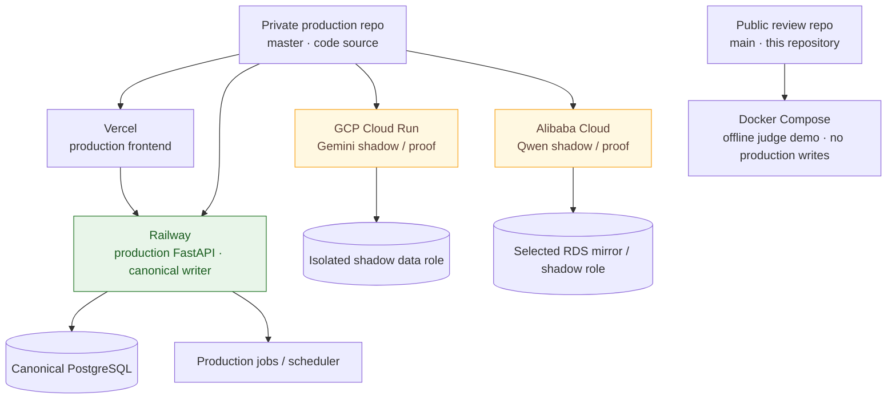

# Deployment Architecture

Pantheon runs on **one code source, several deployment substrates**, with exactly
one canonical production writer. This document describes the deployment model,
environment roles, write/scheduler safety, provider-model proofs, version
observability, and rollback. It contains no secret values — credential state is
referenced as booleans only.

## Code Source and Deployment Roles

- **Private production repository** (`0xjacobzhao-byte/Pantheon-Research`, branch
  `master`) is the source of the production deployments. It is closed-source;
  judges may request temporary read-only access.
- **This public review repository** (`main`) is a sanitized, offline,
  judge-runnable slice. It is **not** a production deployment and writes to no
  production database — it runs via Docker Compose against bundled/local data.

## Environments and Roles

| Environment | Role | Runtime | Data role | Writes / scheduler |
|---|---|---|---|---|
| Vercel | Production frontend | pantheon-research.com | — | — |
| Railway | Production backend / canonical writer | FastAPI + jobs | Canonical PostgreSQL | Enabled |
| GCP Cloud Run | Gemini shadow / proof | Scale-to-zero container | Isolated shadow role | Fail-closed OFF |
| Alibaba Cloud | Qwen shadow / proof | ECS + Nginx + Dockerized FastAPI | Selected RDS mirror | Fail-closed OFF |
| Public judge demo | Offline review slice | Docker Compose | Bundled / local data | No production writes |

## Deployment Triggers

Described at the level of deployment *model* (not secret configuration):

- **Vercel and Railway** deploy from the production repository's native
  git-driven pipeline for the primary product path.
- **Documentation-only changes** are intended to skip application redeploys where
  the pipeline supports it, so docs updates do not churn runtime.
- **GCP and Alibaba** are treated as deliberate, controlled deployments (manual /
  clean-worktree container builds), not automatic followers of every commit.
- Multi-cloud deployment commands are expected to support a dry-run / preview
  mode before any substrate is changed.

No secret environment values, tokens, or connection strings are exposed by any of
these flows in the public repository.

## Canonical Writer and Scheduler Safety

- There is **exactly one canonical production writer** (Railway) to the
  production database.
- **Shadow deployments (GCP, Alibaba) do not mutate the canonical database.**
  Their write path and scheduler are **fail-closed OFF** by role, so a shadow
  environment cannot corrupt production state even if it runs the same image.
- Shadow environments use an **isolated data role** (GCP) or a **selected RDS
  mirror** (Alibaba) — never the canonical production writer role.
- Missing or degraded inputs fail closed rather than writing a guessed value.

## Provider-Specific Model Proofs

- **GCP proves the Gemini integration**; **Alibaba proves the Qwen / DashScope
  integration.** Both run the **same logical overlay contract** as the rest of
  the five-model layer, so a provider proof is a real integration, not a mock.
- The Alibaba deployment exposes a **secret-free** proof endpoint
  (`/api/proof/alibaba-cloud`) that returns booleans only and makes no external
  calls — see [`docs/live_proof.md`](live_proof.md).

## Version Observability and Parity

- Deployments are intended to expose **non-secret version / health markers** —
  commit SHA and runtime role — so an operator can confirm which build and which
  role (production writer vs. shadow) is serving.
- Parity and health checks compare substrates without exposing any token or
  database URL. Credential state is reported as booleans only.

## Migration and Rollback

- Where applicable, database migration runs **before** application startup so a
  runtime never serves against an un-migrated schema.
- **Rollback** returns to the prior Vercel / Railway deployment for the
  production path; shadow substrates roll back by image / revision. Because
  shadows are non-canonical, a shadow rollback cannot affect production data.

## Explicit Non-Claims

- **No three production writers** — exactly one canonical writer.
- **No active-active database** and **no automatic cross-cloud failover.**
- **No identical full production database clones.**
- The **selected Alibaba RDS mirror is not canonical**
  (`production_data_migrated = false`, `mirror_state = partial_selected_mirror`;
  see [`docs/alibaba_deployment_parity.md`](alibaba_deployment_parity.md)).
- The public repository is the **offline judge demo**, not a production
  deployment.

> Some operational specifics (exact triggers, endpoints, and scheduler
> configuration) live in the private production repository and are described here
> as deployment *principles*; they can be reviewed by judges under temporary
> read-only access. Nothing in this document asserts a verified public-repo
> mechanism that is not present on this repository's `main`.
